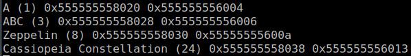

# exploring an array of pointers to various length strings

Example console output:

Memory:

(main.c) v_str_arr is an array of char* pointers. The C Standard guarantees  
that elements of an array are always contiguous in memory. Those pointers are  
all adjacent to each others. But they may point at vastly different locations.  
It is not guaranteed that strings, pointed by those pointers, will be adjacent  
to each other in memory. It depends on compiler.

Big Thank to  #C channel on Libera.Chat
